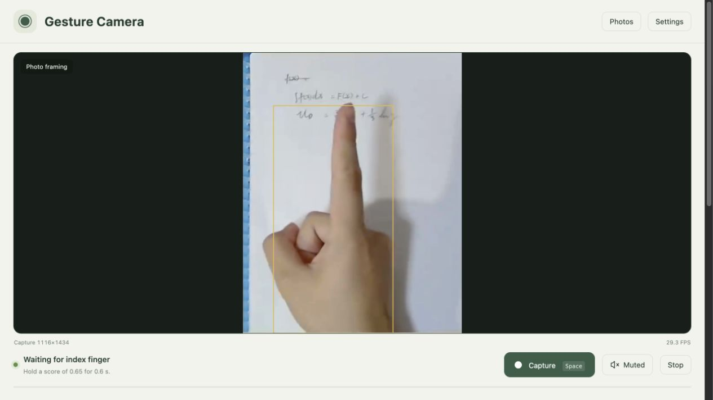
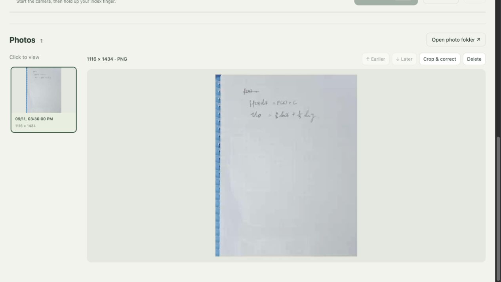
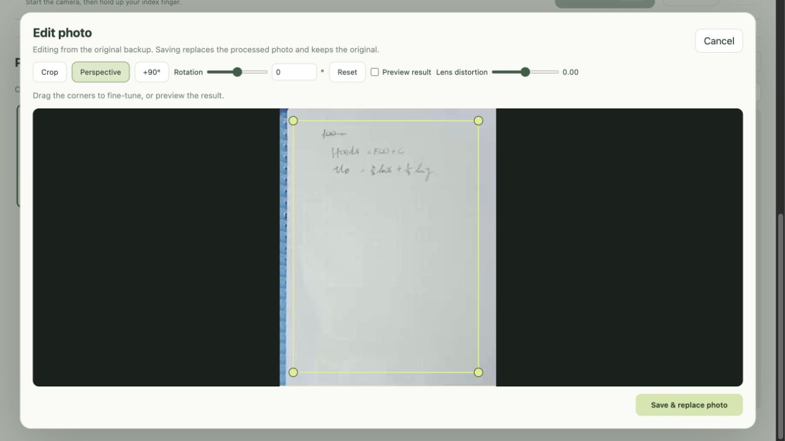

# Gesture Camera

A local macOS camera app with gesture-triggered capture and perspective correction. Built with Tauri, WebKit and MediaPipe.

**0.2.0 Beta · macOS 13+ · Apple Silicon (M-series)**

[**Download for macOS — Apple Silicon (.dmg, 14.9 MB)**](https://github.com/abyteofwallstreet/gesture-camera/releases/download/v0.2.0-beta.1/Gesture-Camera-0.2.0-arm64.dmg) · [Release notes and checksums](https://github.com/abyteofwallstreet/gesture-camera/releases/tag/v0.2.0-beta.1)

## Screenshots

The current interface, shown with sample frames from a recorded demo. Camera input and the photo library are simulated for these screenshots; the displayed dimensions and frame rate are not a hardware benchmark.

**Gesture capture** — a single preview with capture and mute controls.



**Photo browser** — select a thumbnail to view and edit a saved page.



**Crop and correction** — adjust four corners, rotation and lens distortion before replacing the processed photo.



## Download

Download the DMG using the link above, open it, and drag Gesture Camera into Applications. You can also find the installer under **Assets** on the [Beta release page](https://github.com/abyteofwallstreet/gesture-camera/releases/tag/v0.2.0-beta.1).

This beta is ad-hoc signed and has not been notarized by Apple. macOS may block the first launch. After verifying the download source, allow it in System Settings → Privacy & Security if needed. An Intel build is not currently provided.

## Use

1. Open Gesture Camera and click **Start camera**. Allow camera access when prompted.
2. Choose a camera in **Settings → Camera**. Compatible iPhones are available through macOS Continuity Camera.
3. Hold up your index finger, or record your own gesture. The default trigger requires a score of 0.65 for 0.6 seconds, followed by removing your hands for 0.5 seconds.
4. Photos are saved as PNG files in `~/Pictures/Gesture Camera`, or a folder you choose. You can also capture with the button or Space.

Launching the app, opening Settings and refreshing the camera list do not open a camera. Device names may remain hidden until you click Start camera and grant access. Stopping or quitting releases the camera.

## Features

- Full-resolution PNG capture with automatic camera-mode negotiation.
- Local gesture recognition in a separate worker; only the recognition copy is resized.
- Continuous rotation with a separate remembered angle for each camera.
- Four-corner perspective correction and manual lens-distortion adjustment.
- A single camera view showing the framing and correction used for the saved photo. Corner selection temporarily shows the uncorrected image.
- Optional original backup of the entire camera frame. Without correction, one full-frame image is saved.
- Photo thumbnails and a full-size viewer, Earlier/Later buttons for reordering, cropping, correction and deletion.
- Editing uses an original backup when available and keeps it intact; otherwise it replaces the current photo.
- Capture sound with a mute control beside the Capture button.

Deletion moves photo files and metadata into `.gesture-camera-deleted` inside the save folder rather than permanently erasing them.

## Privacy

Photos and gesture recognition stay on your Mac. The app has no cloud processing, LLM, account requirement or microphone capture. Model assets are bundled for offline use. Custom gesture samples are stored locally.

## Camera support and limitations

Use macOS Continuity Camera to connect a compatible iPhone; no companion iPhone app is required. Follow [Apple's setup requirements](https://support.apple.com/en-us/102546). Lens & framing opens the macOS video controls; available lens choices depend on your iPhone and system.

The app requests and checks high-resolution modes exposed by the camera and WebKit. Actual resolution, frame rate and image quality depend on hardware, software, lighting and exposure. Perspective correction and arbitrary-angle rotation resample pixels and cannot recover missing detail.

This is a beta. Automated tests use simulated camera devices; they do not establish real-world gesture accuracy or broad hardware compatibility. See [release notes](RELEASE_NOTES.md) for limitations.

## Build from source

Requires macOS, Node.js/npm, Rust and Xcode Command Line Tools.

```sh
npm ci
mkdir -p models
curl --fail --location \
  'https://storage.googleapis.com/mediapipe-models/gesture_recognizer/gesture_recognizer/float16/1/gesture_recognizer.task' \
  --output models/gesture_recognizer.task
npm run build
open 'src-tauri/target/release/bundle/macos/Gesture Camera.app'
```

The build copies the pinned MediaPipe JavaScript/WASM dependency and the downloaded model into the app. Dependencies and the model require a network connection during setup; running the built app does not. Downloaded assets and build output are excluded from Git.

Release builds through `npm run build` replace local build-machine paths with generic paths before compiling. Use this command when preparing a public build.

Use `npm run dev` for development.

## Verification

```sh
npm test
cargo test --manifest-path src-tauri/Cargo.toml
```

The current unit suite includes 34 JavaScript tests and 9 Rust tests. Browser checks in `scripts/*-check.mjs` cover synthetic camera lifecycle, image geometry, gestures, sound and photo operations. They require Google Chrome and Playwright (`npm install --no-save playwright`), or a Playwright module path supplied through `NOTE_PLAYWRIGHT`. Native WebKit checks additionally require the Swift harness in `scripts/wkwebview-check.swift`.

The packaged app also supports a synthetic self-test without opening a camera:

```sh
'src-tauri/target/release/bundle/macos/Gesture Camera.app/Contents/MacOS/note-capturer-desktop' --self-test
```

## Feedback

[Open an issue](https://github.com/abyteofwallstreet/gesture-camera/issues) with your Mac model, macOS version, camera model, reproduction steps, and expected versus actual behavior. Avoid including private notes or identifying information in screenshots.
